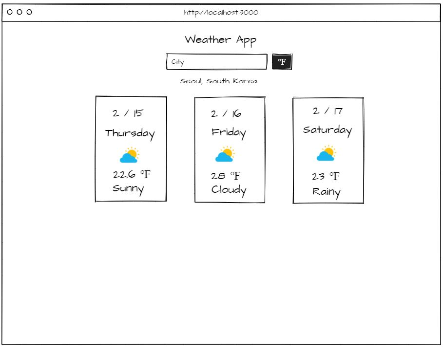

# Weather App
* [App Link](https://weather-react-app-seongsu.herokuapp.com/)

## Wireframe

## App Summary
This application displays the 3 day forecast of any city.

## User Stories
1. As a user, I can enter a name of any city
2. As a user, I can view the 3 day forecast of any city
3. As a user, I can alter the temperature reading between Fahrenheit and Celcius

## Technologies Used

* Weather API
* JavaScript
* HTML / CSS
* Sass
* React
* Heroku
* GitHub

## Approach

* Started by creating user stories, wireframes and targeting users' pain points
* Developed and tested each feature one step at a time before coding the next feature.
